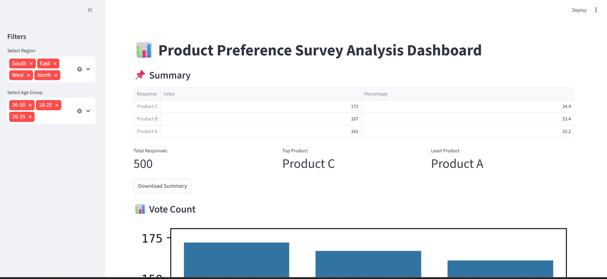
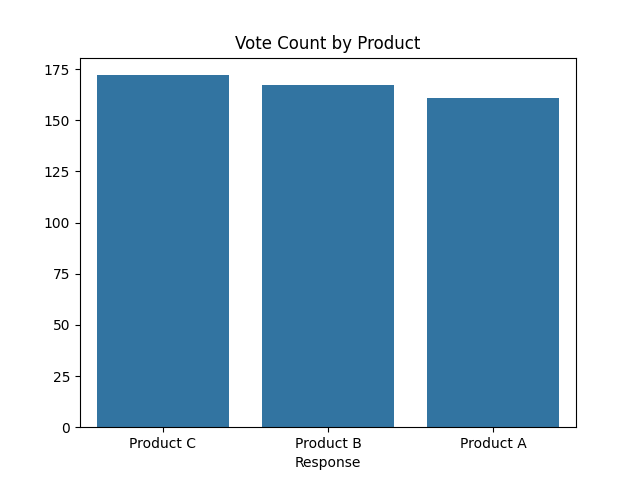
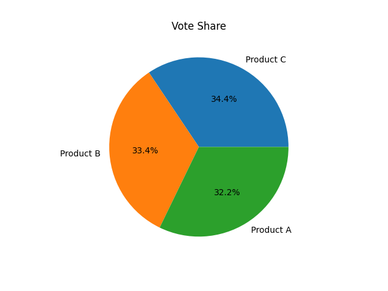
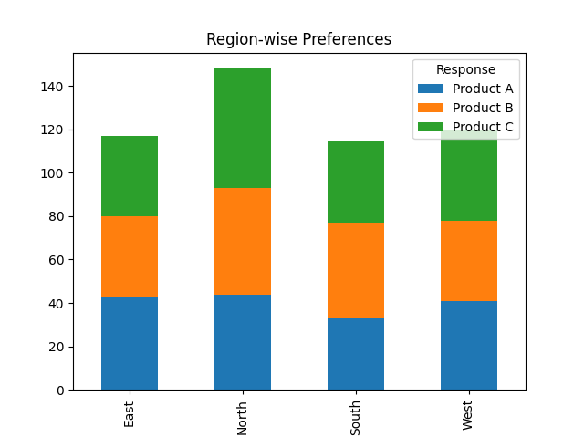
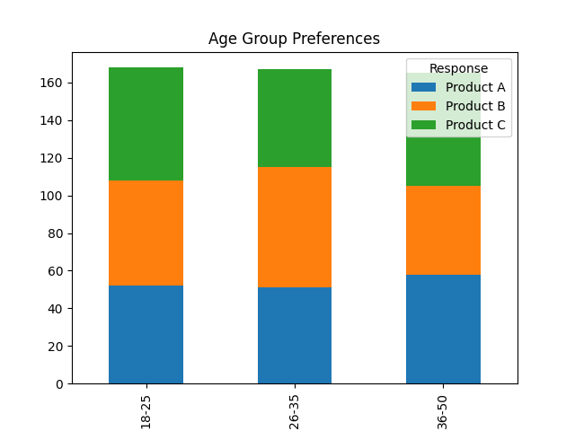
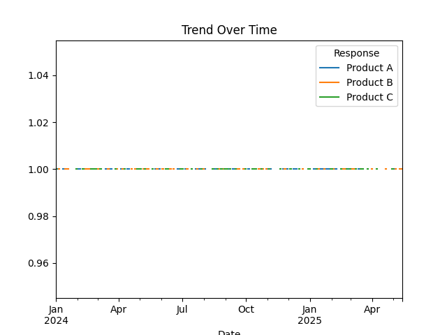

# 📊 Poll Results Visualizer Dashboard

## 🚀 Overview
The Poll Results Visualizer is an interactive data analytics dashboard that transforms raw survey/poll data into meaningful insights using visualization and demographic analysis.

This project simulates real-world business scenarios such as product preference analysis, customer feedback, and market research.

---

## 🎯 Problem Statement
Raw survey data is difficult to interpret and does not provide actionable insights.

Organizations need a system to:
- Analyze responses
- Compare demographics
- Identify trends
- Support decision-making

---

## 💡 Solution
This project builds an end-to-end data analytics pipeline that:
- Cleans and processes poll data
- Performs vote/share analysis
- Segments data by region and age group
- Visualizes results using charts
- Generates business insights

---

## ✨ Features
- 📌 Data Cleaning & Preprocessing
- 📊 Vote Count & Percentage Analysis
- 🌍 Region-wise Analysis
- 👥 Age Group Analysis
- 📈 Interactive Dashboard (Streamlit)
- 🧠 Advanced Insights Generation
- 📥 Downloadable Reports

---

## 🛠️ Tech Stack
- Python
- Pandas
- NumPy
- Matplotlib
- Seaborn
- Streamlit

---

## 📂 Project Structure

Poll-Results-Visualizer/
│
├── data/ # Raw dataset
├── outputs/ # Generated charts
├── notebooks/ # EDA notebooks
├── src/ # Core logic
├── images/ # Screenshots
├── main.py # Backend script
├── streamlit_app.py # Dashboard
├── requirements.txt
└── README.md


---

## ▶️ How to Run

### 1. Clone Repository
```bash
git clone https://github.com/YOUR_USERNAME/poll-results-visualizer.git
cd poll-results-visualizer
```
### 2. Create Virtual Environment
```bash
python -m venv venv
```
### 3. Activate Environment

Windows:
```bash
venv\Scripts\activate
```

Mac/Linux:
```bash
source venv/bin/activate
```
### 4. Install Dependencies
```bash
pip install -r requirements.txt
```
### 5. Run Application
```bash
streamlit run streamlit_app.py
```

---

## 📊 Key Insights
- Product C leads overall but competition is very close
- Different regions show varied preferences
- Age groups demonstrate distinct trends
- Enables targeted marketing and segmentation strategies

---

## 📸 Screenshots

(Add your screenshots here)

- 
- 
- 
- 
- 
- 

---

## 🎯 Use Cases
- Election Poll Analysis
- Customer Feedback Analysis
- Market Research
- Employee Surveys
- Product Preference Studies

---

## 🚀 Future Improvements
- Real-time polling integration
- API-based data ingestion
- Sentiment analysis on feedback
- Power BI dashboard integration
- Machine Learning predictions

---

## 👨‍💻 Author

**Varda Kunde**

⭐ If you like this project, give it a star!"# poll-results-visualizer" 
